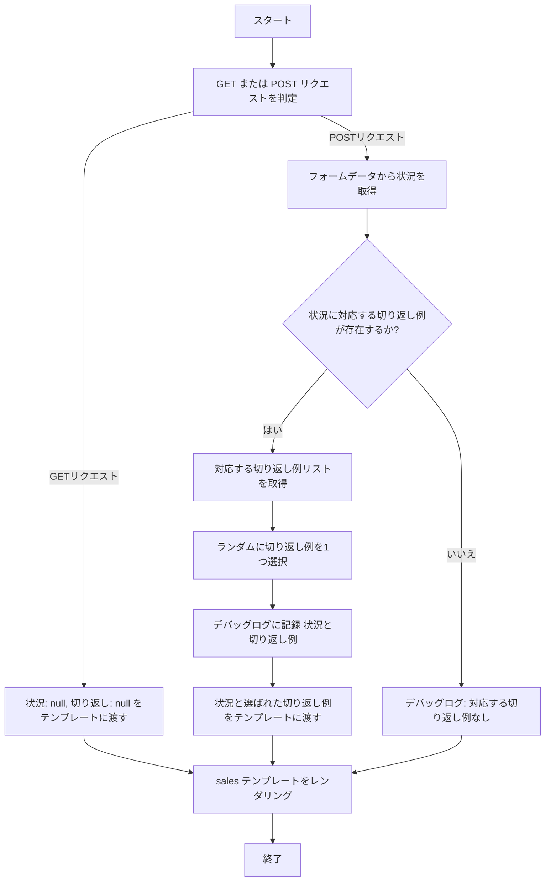
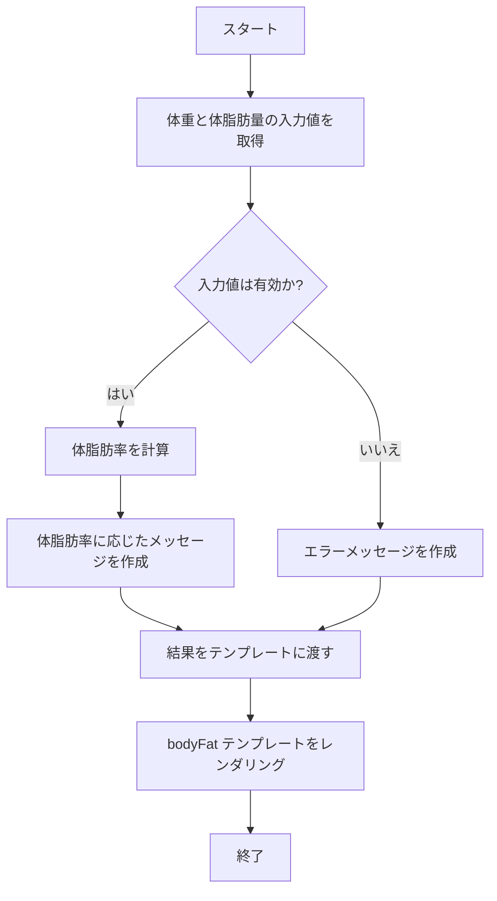

# webpro_06

## このプログラムについて

## ファイル一覧
ファイル名 | 説明
-|-
app5.js | プログラム本体
public/janken.html | じゃんけんの開始画面
views/sales.ejs | 蓄電池訪問販売の開始画面
views/bodyFat.ejs | 体脂肪率（ジム）の表示画面
## じゃんけん
### ファイルの起動方法
1. app5.js を起動する
1. Webブラウザでlocalhost:8080/public/janken.htmlにアクセスする
1. 指示に従い入力する
### プログラムの内容
```javascript
let hand = req.query.hand || "未選択";
```
で,ユーザーの入力を受け取る.
```javascript
const num = Math.floor(Math.random() * 3 + 1);
```
で,CPUの出す手をランダムに決める.
```javascript
if (num === 1) cpu = "グー"; else if (num === 2) cpu = "チョキ"; else cpu = "パー";
```
で,生成したnumの値に応じて,CPUの出す手を決定する.
```javascript
let judgement = "勝ち";
```
で,勝敗を判定する.
### フローチャート
flowchart TD
  A[スタート] --> B[クエリパラメータを取得]
  B --> C{手が指定されているか?}
  C -- はい --> D[手を使用]
  C -- いいえ --> E[手を「未選択」に設定]
  D --> F[勝ち数と対戦回数を取得]
  E --> F
  F --> G{数値に変換}
  G --> H[CPUの手をランダムに決定]
  H --> J[勝敗判定]
  J --> K{勝ち}
  K -- はい --> L[勝ち数 +1]
  K -- いいえ --> M[勝ち数 変更なし]
  L --> N[対戦回数 +1]
  M --> N
  N --> O[結果を表示]
  O --> P[終了]

## 蓄電池訪問販売
### ファイルの起動方法
1. app5.js を起動する
1. Webブラウザでlocalhost:8080/salesにアクセスする
1. 状態を入力する
### プログラムの内容
```javascript
const situation = req.body.situation;
```
で、ユーザーが選択した状況（ネック）を取得する。
```javascript
const possibleResponses = responses[situation];
```
で、選択したネックに対応する切り返し例を取得する。
```javascript
response = possibleResponses[Math.floor(Math.random() * possibleResponses.length)];
```
で、リスト内からランダムに1つの切り返し例を選択する。
```javascript
res.render("sales", { situation, response });
```
で、選択したネックと切り返し例をテンプレートに渡す。
### フローチャート

## 体脂肪率
### ファイルの起動方法
1. app5.js を起動する
1. Webブラウザでlocalhost:8080/bodyFatにアクセスする
1. 必要な数値を入力して送信する
### プログラムの内容
```javascript
const weight = parseFloat(req.body.weight);
```
で、ユーザーが入力した体重（kg）を取得する。
```javascript
const fatMass = parseFloat(req.body.fatMass);
```
で、体脂肪量（kg）を取得する。
```javascript
const bodyFatPercentage = ((fatMass / weight) * 100).toFixed(2);
```
で、体脂肪率を計算する。
```javascript
res.render("bodyFat", { result });
```
で、計算結果をテンプレートに渡す。
### フローチャート

