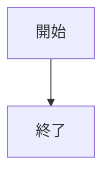
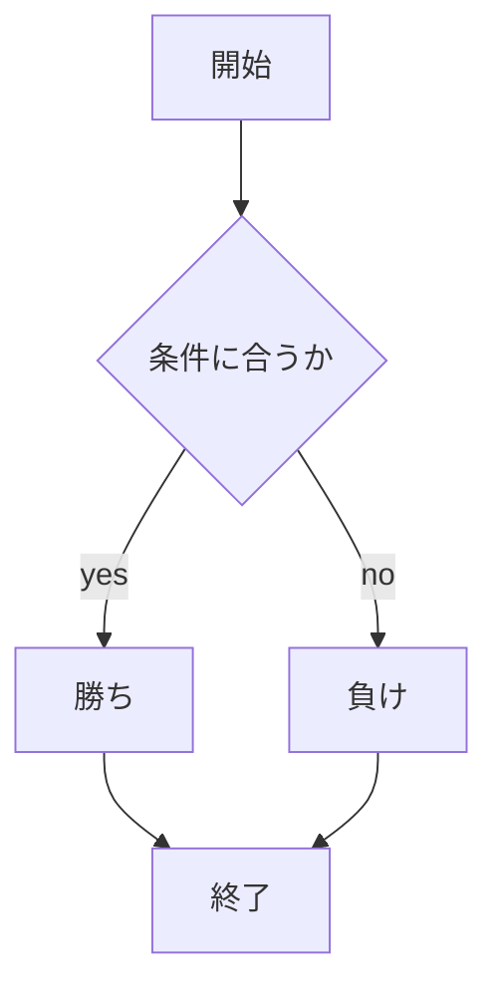

# webpro_06
10/29_2024
## このプログラムについて

## ファイル一覧
ファイル名 | 説明
-|-
app.js | プログラム本体
public/janken.html  | じゃんけんの開始画面
views/janken.ejs | じゃんけんのテンプレートファイル

```javascript
console.log('Hello');
```
## 使用方法
1. app5.jsを起動する
1. Webブラウザで localhost:8080/public/janken.htmlにアクセスする
1. 自分の出す手を入力する






